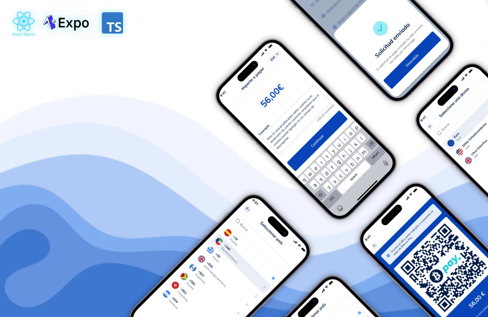

  

## Objective

Create four screens to be used in a testnet environment.

1. The first screen is for creating a payment, which will contain a modal for selecting the payment's FIAT currency.
2. Another screen allows users to share the payment in different ways, such as via email or WhatsApp, and generates a third screen where a QR code appears for the client to scan to reach the payment gateway.
3. A websocket should be included on both the second and third screens to monitor the payment status, with a notification when the payment is completed.
4. Once the payment is completed, the fourth screen should display a "payment completed" message.

- Create Payment:
  The first step is to create a payment by adding the amount, purpose, and FIAT currency (EUR, USD, GBP). The POST orders endpoint will be used to create the payment.

- Share Payment and Generate QR
  After creating the payment, we should offer options to share links via WhatsApp or email, or generate a QR code with the payment link. Upon creating the payment, the web_url field, which is the URL to the payment gateway, will be returned, and this URL should be shared or used in the QR code.

- Important:
  The QR screen and the screen for sharing payment links must update in real time. If a payment is received, the screen should refresh automatically. When a payment is created, a websocket is established, which can be listened to for status updates.

## Run App

    npm install
    npm run start

    # Press I to open iOS simulator
    # Press A to open Android emulator

## Decisions

- Use Expo for easier configurations, installing libraries with the correct versions, better debugging, easier building apk and ipa process, easier use of emulators/simulators, and many other benefits.
- use hooks and Context to handle state. Since there are a few states that need to be accessed in multiple locations.
- Splitted the logic of the application from the visual design.
- use Typescript, and linter + prettier configurations to improve the code quality, readeability and to avoid typing bugs.

## Assumption

- I wasn't able to test the entire payment flow since there was no mock for the final payment part in web, so the WebSocket assumes that status will change as follows: `data.status ===  'completed'` and then will redirect the user to Payment Received screen

## Improvement areas

- Unit and E2E testing to be able to test the app without the UI. Using jest, react testing library and Detox.
- Add transition animation for screen navigations
- add heartbeat to WebSocket in case it gets closed can be closed by intermediary proxies, firewalls, or network issues if it remains idle for too long
